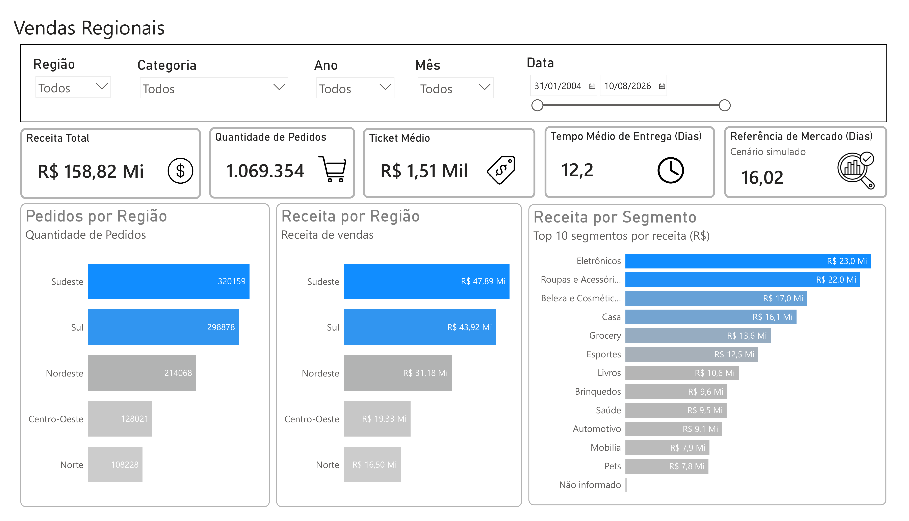
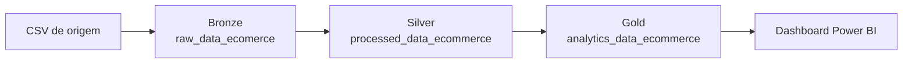

# E-commerce Regional Analytics | Power BI

Projeto de análise de vendas de e-commerce com foco em **qualidade de dados, transformação, modelagem e visualização no Power BI**. A solução parte de uma base histórica com **105 mil registros**, aplica uma organização inspirada na arquitetura Medalhão (Bronze, Silver e Gold) e termina em um dashboard executivo de vendas regionais.



## Visão geral

O objetivo do projeto é transformar uma base de vendas com problemas de qualidade em uma camada analítica adequada para responder perguntas como:

- Qual região concentra maior receita e volume vendido?
- Quais categorias mais contribuem para a receita?
- Qual é o comportamento do prazo de entrega?
- Quais inconsistências da base precisam ser tratadas antes da análise?
- Como documentar as decisões de qualidade e transformação de dados?

## Principais números da base

| Indicador | Resultado |
|---|---:|
| Registros de venda | 105.000 |
| Período analisado | 31/01/2004 a 10/08/2026 |
| Receita total | R$ 158,82 milhões |
| Unidades vendidas | 1.069.354 |
| Ticket médio por registro de venda | R$ 1.512,57 |
| Tempo médio de entrega | 12,2 dias |
| Avaliação média do cliente | 3,79 / 5 |

> **Nota:** a referência de mercado exibida no dashboard é um **cenário simulado**, criado apenas para fins analíticos e explicitamente identificado no relatório.

## Arquitetura dos dados

A organização do tratamento foi inspirada na arquitetura Medalhão:



### Bronze
Camada de ingestão e preservação da estrutura original, mantendo problemas existentes na fonte para permitir diagnóstico e rastreabilidade.

### Silver
Camada de tratamento e padronização, incluindo correções de tipos, textos, valores inconsistentes, datas e outliers.

### Gold
Camada voltada à análise, com os campos já preparados para métricas, filtros e visualizações no Power BI.

> A camada Silver está materializada dentro do arquivo Power BI de Data Quality e não foi exportada como CSV separado nesta versão do repositório.

## Qualidade de dados

A análise da base original identificou problemas intencionais de qualidade que exigiram tratamento.

| Problema | Quantidade / situação | Tratamento |
|---|---:|---|
| Categoria nula | 132 registros | Substituição por `Não informado` |
| Espaços extras em categoria | 14 registros | Remoção de espaços excedentes |
| Variações de categoria | 22 valores brutos -> 12 categorias válidas | Padronização textual |
| Quantidade <= 0 | 38 registros | Tratamento com valor representativo |
| Quantidade contendo texto (`qtd.`) | 7 registros | Separação/limpeza do componente numérico |
| Prazo de entrega inválido | 14 registros | Tratamento de valores < 1 ou > 365 dias |
| Avaliação fora da escala 1-5 | 9 registros | Substituição de valores inconsistentes |
| Desconto igual a zero | 68 registros | Mantido: representa ausência de desconto |
| Métodos de pagamento | 11 variações -> 4 categorias | Padronização para Pix, Boleto, Crédito e Débito |
| Registros duplicados | 0 | Nenhuma remoção necessária |

A documentação completa está disponível em [`docs/relatorio_governanca_data_quality.pdf`](docs/relatorio_governanca_data_quality.pdf) e [`docs/data_quality_outliers.pdf`](docs/data_quality_outliers.pdf).

## Dashboard

O dashboard foi construído para oferecer uma leitura rápida do desempenho regional do e-commerce.

### KPIs

- Receita total
- Volume vendido
- Ticket médio
- Tempo médio de entrega
- Referência de mercado em cenário simulado

### Análises visuais

- Volume vendido por região
- Receita por região
- Receita por segmento/categoria
- Filtros por região, categoria, ano, mês e intervalo de datas

## Insights encontrados

- **Sudeste** lidera em receita, com aproximadamente **R$ 47,89 milhões**, representando **30,2%** do total.
- **Sul** aparece em segundo lugar, com cerca de **R$ 43,92 milhões** (**27,7%**).
- Sudeste + Sul concentram aproximadamente **57,8% da receita** analisada.
- **Eletrônicos** é a categoria com maior receita, com aproximadamente **R$ 23,03 milhões**.
- Eletrônicos, Roupas e Acessórios e Beleza e Cosméticos representam juntos cerca de **39,1% da receita total**.
- O prazo médio de entrega da camada analítica ficou em aproximadamente **12,2 dias**.
- O ticket médio calculado sobre os **105 mil registros de venda** é de aproximadamente **R$ 1,51 mil**.
- A categoria `Não informado` corresponde a apenas **132 registros** e aproximadamente **0,1% da receita**, mas foi preservada para manter transparência sobre a qualidade da fonte.

## Tecnologias e conceitos utilizados

- Power BI Desktop
- Power Query
- DAX
- Modelagem de dados
- Data Quality
- Data Governance
- Arquitetura Medalhão (Bronze / Silver / Gold)
- Tratamento de outliers
- Padronização de dados
- Visualização e storytelling com dados
- CSV


## O que aprendi neste projeto

- Estruturar um projeto de dados do dado bruto até a camada analítica, separando responsabilidades entre Bronze, Silver e Gold.
- Fazer um diagnóstico de qualidade antes de partir para a visualização, identificando nulos, inconsistências textuais, valores inválidos, outliers e problemas de tipagem.
- Diferenciar correções de qualidade de decisões analíticas: nem todo valor incomum deve ser removido, e cada tratamento precisa ter justificativa.
- Padronizar categorias, formas de pagamento, datas e campos numéricos sem perder rastreabilidade da fonte original.
- Usar medidas e transformações no Power BI para construir KPIs coerentes com o significado do dado.
- Validar métricas do dashboard confrontando os valores apresentados com a base tratada, evitando indicadores com nomes ou agregações incorretas.
- Trabalhar a diferença entre métricas como receita, volume vendido, quantidade de registros e ticket médio.
- Projetar um dashboard com hierarquia visual, títulos objetivos, filtros úteis e comparação entre regiões e categorias.
- Documentar regras de Data Quality e premissas do projeto para tornar o processo reproduzível e auditável.
- Comunicar limitações de forma transparente, como no uso da referência de mercado baseada em cenário simulado.
- Organizar um projeto de portfólio com documentação, arquivos de dados, PBIX, imagens e estrutura de repositório.

## Ferramentas utilizadas

- **Power BI Desktop** — construção do dashboard, modelagem e análise visual.
- **Power Query** — limpeza, transformação, tipagem e padronização dos dados.
- **DAX** — criação e validação de indicadores e medidas analíticas.
- **CSV** — armazenamento das camadas de dados disponibilizadas no repositório.
- **Arquitetura Medalhão** — organização lógica do fluxo em Bronze, Silver e Gold.
- **Data Quality** — identificação, classificação e tratamento dos problemas encontrados na base.
- **Data Governance** — documentação das regras, decisões de tratamento, premissas e rastreabilidade.
- **Git/GitHub** — organização e publicação do projeto como portfólio.
- **Markdown** — documentação técnica do projeto, dicionário de dados e README.

## Resultados obtidos

- Construção de uma camada analítica a partir de **105 mil registros históricos de vendas**.
- Consolidação de aproximadamente **R$ 158,82 milhões em receita**.
- Identificação de aproximadamente **1,07 milhão de unidades vendidas**.
- Cálculo de **ticket médio de aproximadamente R$ 1,51 mil**.
- Identificação de **12,2 dias de tempo médio de entrega** na camada analítica.
- Identificação do **Sudeste como região de maior receita**, seguido pelo Sul.
- Constatação de que **Sudeste e Sul concentram cerca de 57,8% da receita total**.
- Identificação de **Eletrônicos como categoria de maior receita**, com cerca de R$ 23 milhões.
- Tratamento e documentação de problemas de qualidade envolvendo categorias, quantidades, prazo de entrega, avaliação e formas de pagamento.
- Criação de um dashboard final com filtros, KPIs e análises por região e segmento.
- Produção de documentação complementar de governança, qualidade de dados, modelo de relacionamentos e dicionário de dados.

> Mais detalhes em [`docs/aprendizados_ferramentas_resultados.md`](docs/aprendizados_ferramentas_resultados.md).

## Estrutura do repositório

```text
ecommerce-regional-analytics/
├── README.md
├── CHECKLIST_ANTES_DE_PUBLICAR.md
├── .gitignore
├── assets/
│   ├── dashboard_vendas_regionais.png
│   ├── modelo_relacionamentos.png
│   └── imagens de governança e data quality
├── data/
│   ├── raw/
│   │   └── dados_historicos_vendas_ecommerce.csv
│   ├── silver/
│   │   └── README.md
│   └── gold/
│       └── analytics_data_ecommerce.csv
├── powerbi/
│   ├── dashboard_vendas_regionais.pbix
│   └── data_quality_medallion.pbix
└── docs/
    ├── dashboard_vendas_regionais.pdf
    ├── data_quality_outliers.pdf
    ├── modelo_relacionamentos.pdf
    ├── relatorio_governanca_data_quality.pdf
    ├── dicionario_dados.md
    ├── qualidade_dados.md
    ├── aprendizados_ferramentas_resultados.md
    ├── linkedin_post.md
    └── github_description.md
```

## Como executar

1. Faça o clone ou download do repositório.
2. Abra `powerbi/dashboard_vendas_regionais.pbix` no Power BI Desktop.
3. Caso o caminho da fonte esteja quebrado, aponte a origem para `data/gold/analytics_data_ecommerce.csv`.
4. Para explorar o processo de qualidade e as camadas de tratamento, abra `powerbi/data_quality_medallion.pbix`.
5. Se necessário, atualize a fonte dessa etapa para `data/raw/dados_historicos_vendas_ecommerce.csv`.

## Documentação

- [Relatório de governança e qualidade](docs/relatorio_governanca_data_quality.pdf)
- [Análise visual de outliers](docs/data_quality_outliers.pdf)
- [Modelo e relacionamentos](docs/modelo_relacionamentos.pdf)
- [Exportação do dashboard](docs/dashboard_vendas_regionais.pdf)
- [Dicionário de dados](docs/dicionario_dados.md)
- [Resumo das regras de qualidade](docs/qualidade_dados.md)

## Limitações e premissas

- A referência de mercado do prazo de entrega é **sintética** e não representa uma pesquisa externa.
- O projeto tem objetivo educacional e de portfólio.
- Algumas decisões de tratamento usam mediana para reduzir influência de valores extremos.
- A camada Silver não foi exportada como arquivo independente nesta versão.
- O arquivo Gold mantém alguns nomes de coluna da implementação original para preservar compatibilidade com o PBIX.

## Próximos passos

- Criar dimensões separadas para calendário, categoria e região.
- Adicionar comparação YoY e variação percentual dos principais KPIs.
- Criar tooltips analíticos e drill-through.
- Documentar as principais medidas DAX em arquivo separado.
- Migrar a arquitetura Medalhão para um ambiente de dados como Databricks/Lakehouse para separar processamento e camada de BI.

---

Este projeto foi desenvolvido com foco não apenas em construir um dashboard, mas em praticar o fluxo completo entre **qualidade da fonte, tratamento, modelagem, análise e comunicação dos resultados**.
